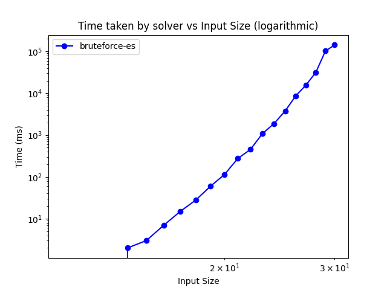

# Vehicle Routing Optimization

Felipe Catapano Emrich Melo

## Project Context

The Vehicle Routing Problem (VRP) is a combinatorial optimization and integer programming problem seeking to service a number of customers with a fleet of vehicles. The VRP is an essential problem in the fields of logistics and transportation, with wide-ranging practical applications from courier services to large-scale distribution networks. However it is considered an NP-hard problem, meaning that finding the optimal solution is computationally infeasible for large instances. 

This project presents a C++ application designed to solve the VRP using various solvers, including brute force, heuristic approaches, and parallelization techniques utilizing OpenMP and MPI.

### Restrictions and Requirements

- Vehicle Capacity: Each vehicle in the fleet has a maximum load capacity. This capacity represents the maximum weight or volume of goods that the vehicle can carry at any given time. The solution must ensure that the total load assigned to each vehicle does not exceed its capacity.

- Customer Demand: Each customer has a specific demand, which represents the quantity of goods they require. This demand must be completely met by a single vehicle, meaning no partial deliveries are allowed.

- Route Cost: Each route has an associated cost, which is a comprehensive measure including the distance traveled, delivery time, and fuel consumption. The objective of the VRP is to minimize the total route cost for the entire fleet.

- Maximum Number of Visits per Route: Each route has a constraint on the maximum number of cities (customers) that can be visited. This limitation ensures that routes remain manageable and within practical operational limits.

- Starting and Arriving Point: All vehicles start and end their routes at the company's warehouse. This requirement ensures a practical implementation of the routing solution, where all vehicles return to the base after completing their deliveries.

## File Structure

```
.
├── build/
│   ├── (This directory holds the compiled files generated during the compilation process.)
├── include/
│   ├── (Header files (.h) required for the project. These files define classes, functions, and constants used throughout the project)
│   ├── brute_force_ES_solver.h
│   ├── brute_force_solver.h
│   ├── graph_class.h
│   ├── heuristic_solver.h
│   ├── mpi_solver.h
│   ├── openmp_solver.h
│   └── openmp-mpi_solver.h
├── docs/
│   ├── (Documentation files)
├── input/
│   ├── (This directory contains input text files representing different problem instances for the Vehicle Routing Problem. Each text file is parsed as an instance of the problem)
├── output/
│   ├── (Holds output files containing answers and solver execution times for each problem instance. These files are generated during the execution of the solvers)
├── slurm/
│   ├── (Files designed to facilitate execution in a cluster environment)
├── solvers/
│   ├── (C++ files (.cpp) for each solver implementation. These files contain the actual code for solving the Vehicle Routing Problem using various algorithms and techniques)
├── src/
│   ├── main.cpp
│   └── graph_class.cpp
├── tools/
│   ├── (Python scripts for generating input files, validation, and benchmarking)
├── makefile
├── README.md
└── requirements.txt
```


## Project Features

1. Solver Selection
The project offers a variety of solvers to tackle the Vehicle Routing Problem (VRP).

2. Batch Processing
The project also includes batch processing capabilities. Users can provide a directory containing input files for VRP instances, and the script will automatically iterate through them, solving each instance sequentially.

3. Plotter
To enable performance analysis and benchmarking, it incorporates a plotter script. Execution times of each solver are logged to individual output files, providing insights into solver efficiency and performance across different VRP instances.

5. Solution Evaluation
Upon solving each VRP instance, the project evaluates and prints the best route combination found by the selected solver. Additionally, it displays the associated cost of the optimized route, aiding in assessing the quality and effectiveness of the solution approach.

6. Input File Generation
For testing and experimentation purposes, the project provides scripts for generating input files representing VRP instances. These scripts enable users to create custom VRP scenarios, facilitating thorough testing and validation of the solvers.

## Usage Instructions

To use the VRP Solver, follow these steps:

#### 1. Clone the Repository
```bash
git clone https://github.com/MekhyW/Vehicle-routing-optimization.git
```

#### 2. Install Python Requirements: 
```bash
pip install -r requirements.txt
```

#### 3. Check MPI and OpenMP Installation
Make sure that mpic++ is installed on your system with OpenMP support. This is required for compiling and running the parallelized solvers.

#### 4. Compile the Project
```bash
make
```

#### 5. Generate Input Graphs
You can generate input graphs programmatically using the provided Python script or create them manually. To generate input graphs using the provided script, run:
```bash
python tools/graph_gen.py <num_nodes>
```
This will generate a graph with the specified number of nodes and save it to a file named `graph-<num_nodes>.txt`. Put the generated file in the input/ directory. If you are writing your own input files manually, make sure to follow the same naming convention.

#### 6. Run the Program
After generating input graphs or preparing them manually, you can execute the program. Use the following command:
```bash
./main <capacity> <max_stops> <solver>
```
Replace `<capacity>` with the maximum capacity of the vehicles, `<max_stops>` with the maximum number of stops allowed, and `<solver>` with the name of the solver you want to use.

#### 7. Example Input File:
Below is an example input file format that can be used as input for the program. Save it as a text file and place it in the input/ directory.
```
5
1 5
2 6
3 4
4 4
10
0 1 22
1 0 22
0 2 47
2 0 47
0 3 23
3 0 23
0 4 30
4 0 30
1 4 14
2 3 71
```

#### 8. Submitting Jobs to a Cluster
If you are running the program on a cluster environment, you can use the provided SLURM scripts to submit jobs. Modify the scripts as needed and submit them using:
```bash
sbatch slurm/{script_name}.slurm
```

## Brute Force Solver

The Brute Force Solver implements a straightforward strategy to solve the Vehicle Routing Problem by exhaustively evaluating all possible combinations of routes, using a stack to keep track of the current route and its options. It serves as the baseline for improvements and optimizations in the subsequent solvers.


The strategy implemented in the Brute Force Solver can be summarized as follows:

#### Generate All Route Combinations:

The solver generates all possible combinations of routes by iterating through subsets of cities (places).
For each subset of cities, it forms a potential route by including all possible permutations of cities within the subset.
#### Filter Invalid Routes:

During route generation, the solver checks for route validity by considering constraints such as vehicle capacity, maximum stops per route, and the validity of the route according to the problem's constraints.
If a generated route violates any constraint, it is discarded.
#### Find the Best Combination:

After generating all valid route combinations, the solver iterates through each combination to evaluate its total cost.
It maintains the best combination found so far, updating it whenever a combination with a lower total cost is encountered.
#### Return Optimal Solution:

Once all combinations have been evaluated, the solver returns the combination with the lowest total cost as the optimal solution to the VRP.

#### Key Functions:
- GenerateAllCombinations: Generates all possible combinations of routes by iterating through subsets of cities and forming routes with valid combinations of cities while considering constraints such as vehicle capacity and maximum stops per route.

- coversAllCities: Checks if a combination of routes covers all cities in the problem instance, ensuring that no city is left unvisited.

- FindBestCombination: Iterates through all generated route combinations, evaluating their total cost and updating the best combination found so far.


## Brute Force with Early Stopping (Brute Force ES)

The Brute Force with Early Stopping (Brute Force ES) solver follows the same algorithmic approach as the regular Brute Force solver. However, it incorporates a very simple optimization technique known as Early Stopping to reduce the search space and improve computational efficiency, by halting the search process as soon as a total cost higher than the current best cost is found.

Unlike the regular Brute Force solver, the ES version does not guarantee finding the global optimal solution. This is because the search may be terminated prematurely if a suboptimal solution is encountered early in the search process.

However, by stopping the search early whenever a combination with a higher total cost is found, this drastically reduces the search space compared to the regular Brute Force solver. This leads to significant improvements in computational efficiency, especially for large problem instances.

#### Demonstration of Exponential Nature
The Brute Force ES solver serves as an excellent demonstration of the exponential nature of the Vehicle Routing Problem (VRP). As the input graph size increases, the time taken by the solver approximately doubles for each increment in the input graph size.


## Heuristic Solver

The Heuristic Solver implements a simple yet effective heuristic approach to solve VRP. Heuristic algorithms are designed to find approximate solutions to complex optimization problems in a reasonable amount of time, sacrificing global optimality for computational efficiency.

#### The 2-Opt Swap Algorithm

The core of the heuristic approach lies in the local search algorithm, which iteratively improves the initial solution by performing 2-opt swaps. 

A 2-opt swap involves removing two edges from the current route and reconnecting them in a different way to potentially reduce the total cost of the route. This process continues until no further improvements can be made.

The following YouTube video, by the professor Tim Roughgarden is an excellent in-depth explanation of the 2-opt swap algorithm and its application in the context of the Traveling Salesman Problem (TSP), which is a closely related problem to the VRP:

[](https://www.youtube.com/watch?v=dYEWqrp-mho&ab_channel=TimRoughgardenLectures)

#### High Efficiency/Scalability

This solver offers extremely improved computational efficiency compared to brute force. By employing the 2-opt swap heuristic, the solver achieves near linear time complexity, making it suitable for handling larger problem instances or scenarios with limited hardware resources.

In tests, the Heuristic Solver has demonstrated remarkable performance, solving VRP instances with up to 1000 cities in just a hundred milliseconds even without any form of parallelization (since the local convergence is achieved with very few loop iterations). This is achieved while still producing good solutions for when the optimal solution is not necessary.


## OpenMP Solver

This extends the brute force approach by using parallel computing capabilities with the OpenMP (omp) library. This solver aims to accelerate the exhaustive search process by distributing tasks across multiple threads, thus reducing the overall computation time for larger input sizes, although some overhead is introduced due to thread management which can outweigh the benefits for small input sizes.

If you need to solve large instances of the VRP (globally) and do not have access to a cluster environment but have a multi-core machine, this might be the best option for you.

#### Parallelization Strategy

- The OpenMP Solver utilizes OpenMP's task parallelism to distribute the work of finding the best combination of routes across multiple threads. Each thread independently explores different parts of the search space, which significantly speeds up the solution process for larger problem instances

- All possible valid route combinations are generated in parallel. This process involves checking each subset of places for capacity constraints, maximum stops, and route validity. By parallelizing this step, the solver quickly creates the initial set of routes to be evaluated

- When calculating the total cost of routes, the OpenMP Solver employs a parallel reduction operation. This ensures that the cost calculation is efficiently distributed across threads and aggregated correctly
''
- The solver dynamically sets the number of threads to the maximum available on the system. This ensures optimal utilization of available computational resources without manual configuration

#### Implementation details

The solve function orchestrates the parallel execution of route evaluations. It generates all possible route combinations and then assigns tasks to threads to evaluate these combinations and find the best solution
```cpp
vector<vector<int>> OpenMPSolver::solve(const vector<int>& places, const map<int, int>& demand, int capacity, int max_stops, Graph& graph, int& bestCost) {
    vector<vector<int>> routes = GenerateAllCombinations(places, demand, capacity, max_stops, graph);
    vector<vector<int>> bestCombination;
    int num_threads = omp_get_max_threads();
    omp_set_num_threads(num_threads);
    #pragma omp parallel
    {
        #pragma omp single nowait
        {
            for (size_t i = 0; i < routes.size(); ++i) {
                #pragma omp task
                {
                    vector<vector<int>> currentCombination;
                    FindBestCombination(routes, currentCombination, i, places, bestCost, bestCombination, graph);
                }
            }
        }
    }
    return bestCombination;
}
```

GenerateAllCombinations creates all valid route combinations in parallel, ensuring that each combination adheres to capacity constraints and maximum stops per route
```cpp
vector<vector<int>> OpenMPSolver::GenerateAllCombinations(const vector<int>& places, const map<int, int>& demand, int capacity, int max_stops, Graph& graph) {
    vector<vector<int>> routes;
    int n = places.size();
    vector<vector<int>> all_routes(1 << n);
    #pragma omp parallel for
    for (int i = 1; i < (1 << n); i++) {
        vector<int> route;
        int total_demand = 0;
        unordered_map<int, int> place_count;
        bool invalid = false;
        for (int j = 0; j < n; j++) {
            if (i & (1 << j)) {
                int place = places[j];
                route.push_back(place);
                total_demand += demand.at(place);
                place_count[place]++;
                if (total_demand > capacity || place_count[place] > max_stops || !graph.verifyValidRoute(route)) {
                    invalid = true;
                    break;
                }
            }
        }
        if (!invalid) {
            all_routes[i] = route;
        }
    }
    for (int i = 1; i < (1 << n); i++) {
        if (!all_routes[i].empty()) {
            routes.push_back(all_routes[i]);
        }
    }
    return routes;
}
```

FindBestCombination evaluates each combination of routes in parallel. It uses OpenMP tasks to assign different parts of the search space to different threads, ensuring efficient exploration and updating of the best solution found. The critical section is used to ensure that only one thread updates the best cost and combination and there are no race conditions.
```cpp
void OpenMPSolver::FindBestCombination(const vector<vector<int>>& routes, vector<vector<int>>& currentCombination, size_t index, const vector<int>& places, int& bestCost, vector<vector<int>>& bestCombination, Graph& graph) {
    stack<pair<int, int>> stack;
    stack.push(make_pair(index, 0));
    while (!stack.empty()) {
        pair<int, int> top = stack.top();
        stack.pop();
        int i = top.first;
        int option = top.second;
        if (option == 0) {
            if (coversAllCities(currentCombination, places)) {
                int totalCost = CalculateTotalCost(currentCombination, graph);
                if (totalCost < bestCost) {
                    #pragma omp critical
                    {
                        bestCost = totalCost;
                        bestCombination = currentCombination;
                    }
                }
                continue;
            }
        }
        if (option == 0 && static_cast<size_t>(i) < routes.size()) {
            currentCombination.push_back(routes[i]);
            stack.push(make_pair(i, 1));
            stack.push(make_pair(i + 1, 0));
        } else if (option == 1) {
            currentCombination.pop_back();
            stack.push(make_pair(i + 1, 0));
        }
    }
}
```


## MPI Solver

Simmilarly to the OpenMP solver, the MPI Solver extends the brute force approach by using parallel computing capabilities, but this time with a distributed memory model instead of shared memory. It is intended for use in a multimachine cluster environment, where multiple processes (in multiple pools of memory) are allocated to solve the VRP.

#### Parallelization Strategy

- This Solver distributes the task of evaluating route combinations across multiple processes. Each process works on a subset of the total combinations, significantly reducing the overall computation time for large problem instances

- It dynamically divides the route combinations among the available processes. Each process independently evaluates its assigned combinations, ensuring a balanced workload distribution

- The solver employs MPI for communication between processes. It uses MPI functions for data sharing, such as broadcasting the best cost found and reducing local best results to determine the global best solution

- After local evaluations, the results are synchronized and aggregated to find the global best solution. This involves reducing the local best costs and combining the best combinations from each process to determine the optimal route configuration

#### Implementation details

The distributeWork function calculates the start and end indices of the route combinations assigned to each process, ensuring an even distribution of work
```cpp
void MPISolver::distributeWork(const vector<vector<int>>& routes, int& start, int& end, MPI_Comm comm) {
    int rank, size;
    MPI_Comm_rank(comm, &rank);
    MPI_Comm_size(comm, &size);
    int routeCount = routes.size();
    int routesPerProcess = routeCount / size;
    int remainder = routeCount % size;
    start = rank * routesPerProcess + min(rank, remainder);
    end = start + routesPerProcess + (rank < remainder ? 1 : 0);
}
```

FindBestCombination in this case is run in subsets of the route combinations, with each process evaluating its assigned combinations. The best cost and combination are then reduced across all processes to determine the global optimal solution
```cpp
void MPISolver::FindBestCombination(const vector<vector<int>>& routes, vector<vector<int>>& currentCombination, int index, const vector<int>& places, int& bestCost, vector<vector<int>>& bestCombination, Graph& graph, MPI_Comm comm) {
    int rank, size;
    MPI_Comm_rank(comm, &rank);
    MPI_Comm_size(comm, &size);
    int start, end;
    distributeWork(routes, start, end, comm);
    stack<pair<int, int>> stack;
    stack.push(make_pair(index, 0));
    int localBestCost = INT_MAX;
    vector<vector<int>> localBestCombination;
    while (!stack.empty()) {
        auto [i, option] = stack.top();
        stack.pop();
        if (option == 0) {
            if (coversAllCities(currentCombination, places)) {
                int totalCost = 0;
                for (const auto& route : currentCombination) {
                    totalCost += graph.calculateRouteCost(route);
                }
                if (totalCost < localBestCost) {
                    localBestCost = totalCost;
                    localBestCombination = currentCombination;
                }
                continue;
            }
        }
        if (option == 0 && i >= start && i < end && static_cast<size_t>(i) < routes.size()) {
            currentCombination.push_back(routes[i]);
            stack.push(make_pair(i, 1));
            stack.push(make_pair(i + 1, 0));
        } else if (option == 1) {
            currentCombination.pop_back();
            stack.push(make_pair(i + 1, 0));
        }
    }
    MPI_Allreduce(&localBestCost, &bestCost, 1, MPI_INT, MPI_MIN, comm);
    if (localBestCost == bestCost) {
        bestCombination = localBestCombination;
    }
    for (int i = 0; i < size; ++i) {
        if (i == rank) {
            for (const auto& route : bestCombination) {
                int routeSize = route.size();
                MPI_Send(&routeSize, 1, MPI_INT, 0, 0, comm);
                MPI_Send(route.data(), routeSize, MPI_INT, 0, 0, comm);
            }
        } else if (rank == 0) {
            vector<vector<int>> tempCombination;
            for (size_t j = 0; j < bestCombination.size(); ++j) {
                int routeSize;
                MPI_Recv(&routeSize, 1, MPI_INT, i, 0, comm, MPI_STATUS_IGNORE);
                vector<int> route(routeSize);
                MPI_Recv(route.data(), routeSize, MPI_INT, i, 0, comm, MPI_STATUS_IGNORE);
                tempCombination.push_back(route);
            }
            if (coversAllCities(tempCombination, places)) {
                int tempCost = 0;
                for (const auto& route : tempCombination) {
                    tempCost += graph.calculateRouteCost(route);
                }
                if (tempCost < bestCost) {
                    bestCost = tempCost;
                    bestCombination = tempCombination;
                }
            }
        }
    }
}
```


## OpenMP-MPI Solver

Finally, the OpenMP-MPI Solver combines the parallelization techniques of both OpenMP and MPI to leverage the benefits of shared and distributed memory models.

This solver was created by improving the MPI solver, introducing additional parallelism within each MPI process using OpenMP. This allows for concurrent execution of tasks within each process, reducing the overall computation time further than using MPI alone. This is specially true in cases where load balancing would be an issue with MPI alone.

It is intended for large cluster environments and supercomputers, where each subprocess still has strong computational resources to benefit from OpenMP parallelism and further speed up the solution process.

Just like with the OpenMP Solver, GenerateAllCombinations is parallelized in threads and cost calulation is done in parallel as well. The FindBestCombination function is also parallelized using OpenMP tasks to evaluate different parts of the search space concurrently. Work is distributed among MPI processes, and within each process, OpenMP tasks are used to evaluate route combinations in parallel, with the results being synchronized using MPI_Allreduce to find the global best solution.
```cpp
MPI_Allreduce(MPI_IN_PLACE, &bestCost, 1, MPI_INT, MPI_MIN, comm);
```


## Performance Analysis

In order to evaluate the performance of the solvers, the script tools/plotter.py can be used to generate plots of the execution times for each solver across different problem instances. 




After running a solver on a set of problem instances, run the tool with the following command:
```bash
python tools/plotter.py
```
And two plots will be shown on screen using the matplotlib GUI: one in linear scale and one in logarithmic scale. You can use it to adjust plot parameters and save the plot to an image file for further analysis later.


## Contributing

Contributions to the project are welcome! If you found this project interesting or useful and have any ideas, suggestions, or improvements, feel free to submit a pull request or open an issue. Your feedback is valuable and helps enhance the project for the community of users :)